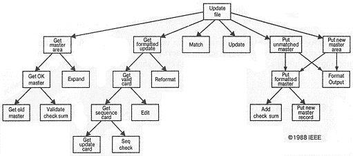

### Объектно-ориентированное программирование

Лекция 1. Сложность разработки программного обеспечения

Филонов Павел (filonovpv@gmail.com)


### О сложности

Л. Петерс 

 > В мире очень мало гениев, и не надо думать,
 > будто в среде программистов их доля выше средней

Ф. Брукс 

 > Cложность программного обеспечения -
 > отнюдь не случайное его свойство


### Основные причины

 * сложность реальной предметной области;
 * трудность управления процессом разработки;
 * необходимость обеспечить гибкость программы;
 * проблема описания поведения дискретных систем.


### Решение

Э. Дийкстра

 > Способ управления сложными системами был известен 
 > еще в древности - divide et impera (разделяй и властвуй)


### Алгоритмическая декомпозиция




### Объектно-ориентированная декомпозиция


### Объектно-ориентированное программирование

Объектно-ориентированное программирование (object-oriented programming) - это методология программирования, основанная на представлении программы в виде совокупности объектов, каждый из которых является экземпляром определенного класса, а классы образуют иерархию наследования.


### Основные положения ООП

1. ООП использует в качестве базовых элементов *объекты*, а не алгоритмы
2. Каждый объект является *экземпляром* какого-либо определенного *класса*
3. Классы организованы *иерехически*


### Объектно-ориентированное проектирование

Объектно-ориентированное проектирование (object-oriented design) - это методология проектирования, соединяющая в себе процесс объектной декомпозиции и приемы представления логической и физической, а также статической и динамической моделей проектируемой системы.


### Объектно-ориентированный анализ

Объектно-ориентированный анализ (object-oriented analysis)- это методология, при которой требования к системе воспринимаются с точки зрения классов и объектов, выявленных в предметной области.


### Связка OOP, OOD и OOA

На результатах ООА формируются модели, на которых основывается OOD; OOD в свою очередь создает фундамент для окончательной реализации системы с использованием методологии OOP.


### Элементы объктной модели

* абстрагирование;
* инкапсюляция;
* модельность;
* иерархия.


### Абстрагирование

Абстракция выделяет существенные характеристики некоторого объекта, отличающие его от всех других видов объектов и, таким образом, четко определяет его концептуальные границы с точки зрения наблюдателя.


### Пример абстрагирования

```c++
// Температура по Фаренгейту
using Temperature = double;
// Число, однозначно определяющее положение датчика
using Location = int;

class TemperatureSensor {
 public:
    TemperatureSensor(Location);

    void calibrate(Temperature actualTemperature);

    Temperature currentTemperature() const;
 private:
};

```


### Инкапсуляция


Инкапсуляция - это процесс отделения друг от друга элементов объекта, определяющих его устройство и поведение; инкапсуляция служит для того, чтобы изолировать контрактные обязательства абстракции от их реализации.


### Пример инапсуляции

```c++
class Heater {
 public:
    Heater(Location);
    void turnOn();
    void tum0ff();
    Boolean isOn() const;
 private:
};
```

```c++
class SerialPort {
 public:
    SerialPort();
    void write(char*);
    void write(int);
    static SerialPort ports[10];
 private:
};
```


### Пример инапсуляции (продолжение)

```c++
class Heater {
public:
...
protected:
    const Location repLocation;
    Boolean repIsOn;
    SerialPort* repPort;
};
```


### Модульность

Модульность - это свойство системы, которая была разложена на внутренне связные, но слабо связанные между собой модули.


### Иерархия

Иерархия - это упорядочение абстракций, расположение их по уровням.


### Классы и объекты


Объект обладает состоянием, поведением и идентичностью; структура и поведение схожих объектов определяет общий для них класс; термины "экземпляр класса" и "объект" взаимозаменяемы.